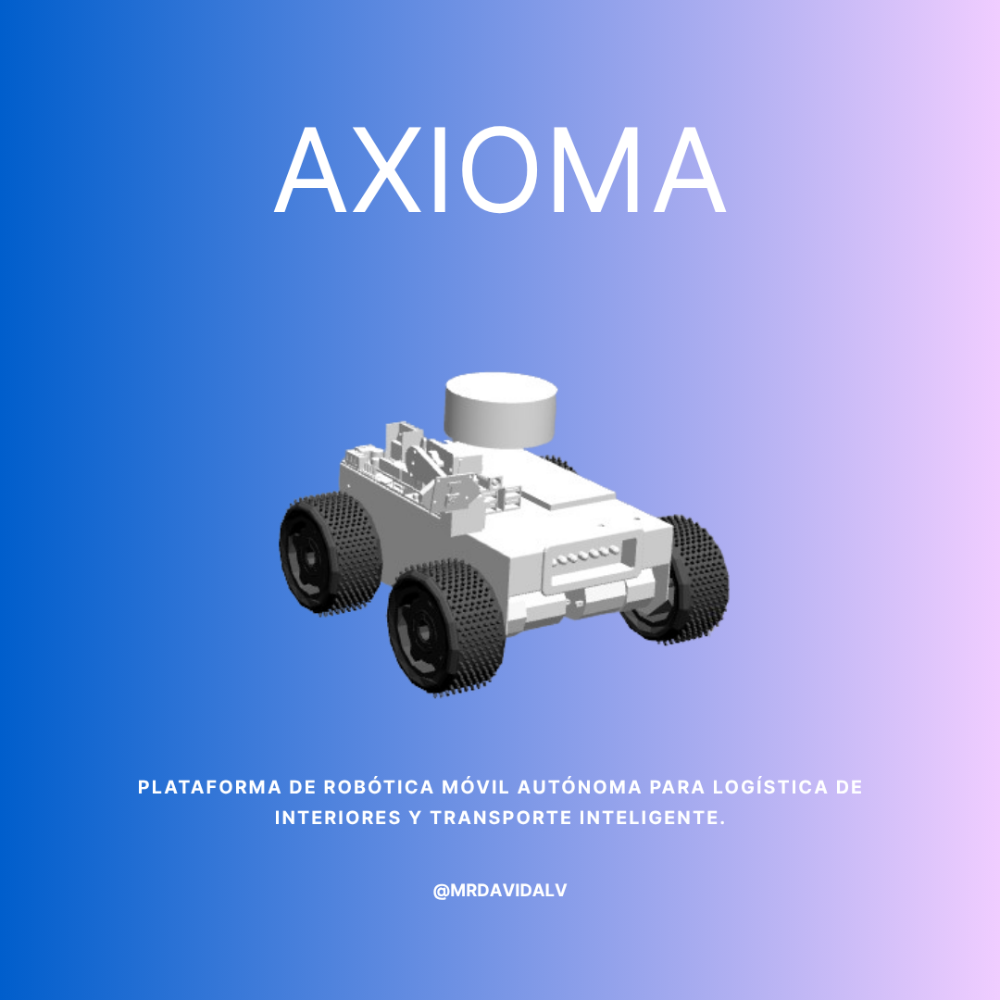
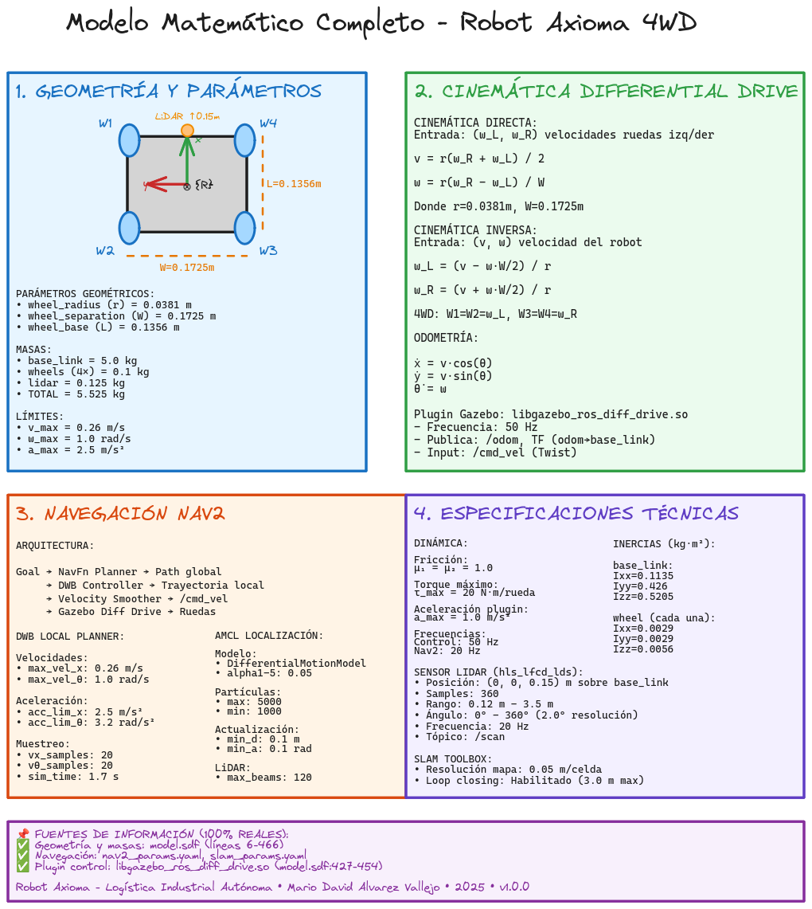

# 🤖 Robot Autónomo Axioma 4WD

<div align="center">

</div>

[](#)
[](#)
[](#)
[](#)
[](#)
[](#)
[](#)
[](#)
[](#)
[](#)
[](#)
[](#)
<!-- [](#) -->
<!-- [](#) -->
[](#)
[](LICENSE)
[](#)
[](https://github.com/MrDavidAlv/Axioma_robot)

---

## 🚀 Quick Start

```bash
# 1. Instalar ROS2 Humble (Ubuntu 22.04)
sudo apt update && sudo apt install ros-humble-desktop

# 2. Instalar dependencias del proyecto
sudo apt install -y python3-colcon-common-extensions python3-rosdep python3-argcomplete \
                     gazebo ros-humble-gazebo-ros-pkgs \
                     ros-humble-robot-state-publisher ros-humble-joint-state-publisher \
                     ros-humble-navigation2 ros-humble-nav2-bringup ros-humble-slam-toolbox \
                     ros-humble-joy ros-humble-teleop-twist-keyboard \
                     ros-humble-rviz2 ros-humble-xacro ros-humble-tf2-tools

# 3. Clonar y compilar el proyecto
mkdir -p ~/ros2/axioma_humble_ws/src
cd ~/ros2/axioma_humble_ws/src
git clone https://github.com/MrDavidAlv/Axioma_robot.git .
cd ~/ros2/axioma_humble_ws
colcon build --symlink-install
source install/setup.bash

# 4. Lanzar SLAM para crear mapas
ros2 launch axioma_bringup slam_bringup.launch.py

# O lanzar navegación autónoma (requiere mapa previo)
ros2 launch axioma_bringup navigation_bringup.launch.py
```

**📖 Ver [Instalación Detallada](#-instalación) | [Guía de Ejecución](#-ejecución)**

---

## 📖 Descripción

Este proyecto desarrolla software de navegación autónoma con ROS2 para la plataforma robótica móvil **Axioma.io**, diseñada por el Semillero de Robótica SIRO. El sistema implementa algoritmos de SLAM (Simultaneous Localization and Mapping) para mapeo en tiempo real, localización mediante AMCL (Adaptive Monte Carlo Localization) y planificación de trayectorias con Nav2, automatizando el transporte de productos en cadenas de producción industrial sin intervención humana.

### 🔑 Palabras Clave

Robot móvil, navegación autónoma, logística industrial, planificación de trayectorias, ROS2 Humble, Nav2, SLAM, differential drive, skid-steering

### 🎯 Objetivo General

Diseñar, simular e implementar software de planificación de trayectorias robóticas para la plataforma Axioma.io, permitiendo el transporte autónomo de productos entre puntos designados dentro de espacios de trabajo, automatizando la gestión logística en cadenas de producción.

### 📋 Objetivos Específicos

- Diseñar un entorno de simulación tridimensional que emula áreas de trabajo con obstáculos
- Instrumentar el robot virtual con sensores de navegación y mapeo (LiDAR, encoders, IMU)
- Programar el ecosistema ROS2 con nodos para localización (AMCL), control (differential drive) y navegación (Nav2)
- Desarrollar técnicas de planificación de trayectorias considerando obstáculos y restricciones cinemáticas
- Integrar el software en el robot físico Axioma.io con sensores reales para odometría y control

### 🎥 Demostración Completa

<div align="center">

[](https://www.youtube.com/watch?v=hl_HeULvuvQ)

**[▶️ Ver video completo en YouTube](https://www.youtube.com/watch?v=hl_HeULvuvQ)**

*Demostración integral: SLAM en tiempo real, guardado de mapa y navegación autónoma Nav2*

</div>

---

## 📑 Tabla de Contenidos

- [Quick Start](#-quick-start)
- [Descripción](#-descripción)
- [Características Principales](#-características-principales)
- [Galería del Robot](#-galería-del-robot)
- [Videos del Sistema](#-videos-del-sistema)
- [Arquitectura del Sistema](#-arquitectura-del-sistema)
- [Modelo Matemático](#-modelo-matemático)
- [Requisitos del Sistema](#-requisitos-del-sistema)
- [Instalación](#-instalación)
- [Compilación](#-compilación)
- [Ejecución](#-ejecución)
- [Estructura del Proyecto](#-estructura-del-proyecto)

---

## 🌟 Características Principales

<div align="center">

| Feature | Descripción |
|---------|-------------|
| 🗺️ **SLAM en Tiempo Real** | Mapeo simultáneo y localización con SLAM Toolbox asíncrono |
| 🎯 **Navegación Autónoma** | Sistema Nav2 completo con planificación global (NavFn) y local (DWB) |
| 🚧 **Evitación de Obstáculos** | Detección y evasión en tiempo real con LiDAR 360° RPLidar A1 |
| 🎮 **Control Teleoperable** | Soporte para Xbox controller y teleop_twist_keyboard durante mapeo |
| 📊 **Visualización Completa** | RViz2 con costmaps dinámicos, trayectorias planificadas y partículas AMCL |
| 🤖 **Robot Diferencial 4WD** | Odometría robusta con encoders de 1000 PPR y control skid-steering |
| 🔧 **Totalmente Configurable** | Parámetros Nav2, AMCL, SLAM y DWB ajustables según aplicación |
| 💻 **Código Abierto** | Licencia BSD - Libre para uso académico, investigación y comercial |

</div>

---

## 📸 Galería del Robot

<div align="center">
<table>
  <tr>
    <td></td>
    <td></td>
  </tr>
  <tr>
    <td></td>
    <td></td>
  </tr>
  <tr>
    <td></td>
    <td></td>
  </tr>
</table>
</div>

---

## 🎥 Videos del Sistema

> **Nota:** Los siguientes videos corresponden a la versión con ROS2 Foxy. La funcionalidad en Humble es idéntica con mejoras en rendimiento y estabilidad.

<div align="center">

| **Navegación Autónoma** | **SLAM y Mapeo** |
|:------------------------:|:-----------------:|
| [](https://youtu.be/U28n4vSAwDk) | [](https://youtu.be/A-7UMoYXUBQ) |
| *Navegación en entorno con mapa* | *Mapeo en tiempo real con LiDAR* |

| **Sensores y Frames TF** | **Ensamblaje Mecánico** |
|:---------------------:|:-----------------:|
| [](https://youtu.be/dHnnpMOO5yg) | [](https://youtu.be/buS84GiqQug) |
| *Visualización RViz y odometría* | *Diseño CAD en Autodesk Inventor* |

| **Competencia Mercury Robotics** | **Control Teleoperado** |
|:-----------------------------:|:--------------------------:|
| [](https://youtu.be/8E0mYynNUog) | [](https://youtu.be/sHgdL3dffgw) |
| *Axioma One en Mercury 2019* | *Teleoperación Raspberry Pi + Flask* |

</div>

---

## 🏗️ Arquitectura del Sistema

### Transformadas (TF Tree)
<div align="center">

</div>

Árbol de transformadas espaciales: `map → odom → base_footprint → base_link → sensors`. El plugin differential drive publica `odom → base_link`, AMCL publica `map → odom` para corrección de deriva odométrica.

### Sistema SLAM
<div align="center">

</div>

SLAM Toolbox implementa graph-based SLAM generando mapas 2D en tiempo real. Procesa LiDAR a 5.5 Hz y odometría a 50 Hz con optimización de pose-graph y loop closure.

### Sistema de Navegación
<div align="center">

</div>

Nav2 stack integra planificador global NavFn (Dijkstra), controlador local DWB (Dynamic Window Approach), costmaps dinámicos y behaviors de recuperación.

---

## 📐 Modelo Matemático

<div align="center">

</div>

Modelo matemático completo de cinemática diferencial 4WD skid-steering. El diagrama muestra geometría, ecuaciones de control, sistema Nav2 y especificaciones dinámicas.

### 📚 Documentación Técnica

Documentación detallada disponible en [`documentacion/modelo-matematico/`](./documentacion/modelo-matematico/):

| Documento | Descripción |
|-----------|-------------|
| **[README](./documentacion/modelo-matematico/README.md)** | Introducción y estructura del modelo |
| **[Cinemática](./documentacion/modelo-matematico/cinematica.md)** | Modelos directo/inverso y odometría |
| **[Control](./documentacion/modelo-matematico/control.md)** | Plugin Gazebo, Nav2 DWB y AMCL |
| **[Parámetros](./documentacion/modelo-matematico/parametros.md)** | Parámetros físicos reales verificados |
| **[Diagrama Excalidraw](./documentacion/modelo-matematico/modelo-axioma.excalidraw)** | Representación visual editable (JSON) |

### 🔬 Parámetros Clave

- Radio de rueda: $r = 0.0381$ m | Separación: $W = 0.1725$ m | Masa: $m = 5.525$ kg
- Velocidades máximas: $v_{max} = 0.26$ m/s, $\omega_{max} = 1.0$ rad/s
- Aceleraciones máximas: $a_{max} = 2.5$ m/s², $\alpha_{max} = 3.2$ rad/s²

**Cinemática Diferencial**: $v = \frac{r(\omega_R + \omega_L)}{2}$, $\omega = \frac{r(\omega_R - \omega_L)}{W}$

---

## 💻 Requisitos del Sistema

### Software Base
- **Sistema Operativo**: Ubuntu 22.04 LTS
- **ROS2**: Humble Hawksbill
- **Gazebo**: Classic 11
- **Python**: 3.8+ | **CMake**: 3.16+

### Dependencias ROS2 Principales
```bash
ros-humble-navigation2        # Nav2 stack completo
ros-humble-slam-toolbox       # SLAM para mapeo
ros-humble-gazebo-ros-pkgs    # Simulación Gazebo
ros-humble-rviz2              # Visualización
ros-humble-teleop-twist-keyboard  # Teleoperación
```

### Hardware Recomendado
- **CPU**: Intel i5 8th Gen / AMD Ryzen 5+ (4 núcleos)
- **RAM**: 8 GB mínimo, 16 GB recomendado
- **Almacenamiento**: 10 GB libres

---

## 🔧 Instalación

### 1. Instalar ROS2 Humble

```bash
# Configurar locale y repositorio
sudo apt update && sudo apt install locales curl
sudo locale-gen en_US en_US.UTF-8
sudo curl -sSL https://raw.githubusercontent.com/ros/rosdistro/master/ros.key -o /usr/share/keyrings/ros-archive-keyring.gpg
echo "deb [arch=$(dpkg --print-architecture) signed-by=/usr/share/keyrings/ros-archive-keyring.gpg] http://packages.ros.org/ros2/ubuntu $(. /etc/os-release && echo $UBUNTU_CODENAME) main" | sudo tee /etc/apt/sources.list.d/ros2.list > /dev/null

# Instalar ROS2 Humble Desktop
sudo apt update && sudo apt upgrade
sudo apt install ros-humble-desktop
```

### 2. Instalar Dependencias del Proyecto

```bash
sudo apt install -y \
  python3-colcon-common-extensions python3-rosdep \
  gazebo ros-humble-gazebo-ros-pkgs \
  ros-humble-navigation2 ros-humble-nav2-bringup \
  ros-humble-slam-toolbox ros-humble-rviz2 \
  ros-humble-teleop-twist-keyboard ros-humble-joy \
  ros-humble-robot-state-publisher ros-humble-tf2-tools

sudo rosdep init && rosdep update
```

### 3. Clonar y Compilar

```bash
mkdir -p ~/ros2/axioma_humble_ws/src
cd ~/ros2/axioma_humble_ws/src
git clone https://github.com/MrDavidAlv/Axioma_robot.git .
cd ~/ros2/axioma_humble_ws
colcon build --symlink-install
source install/setup.bash
echo "source ~/ros2/axioma_humble_ws/install/setup.bash" >> ~/.bashrc
```

---

## 🚀 Ejecución

### SLAM (Mapeo)

```bash
source ~/ros2/axioma_humble_ws/install/setup.bash
ros2 launch axioma_bringup slam_bringup.launch.py
```

**Control**: En terminal separada ejecutar `ros2 run teleop_twist_keyboard teleop_twist_keyboard`

**Guardar mapa**:
```bash
ros2 run nav2_map_server map_saver_cli -f src/axioma_navigation/maps/mi_mapa
```

### Navegación Autónoma

```bash
source ~/ros2/axioma_humble_ws/install/setup.bash
ros2 launch axioma_bringup navigation_bringup.launch.py
```

**Uso en RViz2**:
1. Botón `2D Pose Estimate`: establecer pose inicial del robot
2. Botón `2D Goal Pose`: enviar objetivo de navegación
3. Monitorear: costmaps (global/local), paths (global/local) y partículas AMCL

---

## 📂 Estructura del Proyecto

```
axioma_humble_ws/
├── src/
│   ├── axioma_bringup/          # Launches principales (SLAM + Nav2)
│   ├── axioma_navigation/       # Configs Nav2, SLAM, mapas
│   └── axioma_description/      # Modelo SDF/URDF, meshes, worlds
├── documentacion/
│   └── modelo-matematico/       # Docs técnicas (cinemática, control)
├── images/                      # Recursos visuales
└── README.md
```

---

## 🔍 Sistema de Control

### Plugin Differential Drive (Gazebo)

Plugin `libgazebo_ros_diff_drive.so` implementa control cinemático directo:
- Lee `/cmd_vel` → $(v, \omega)$
- Aplica cinemática inversa: $\omega_{L/R} = (v \mp \omega W/2) / r$
- Controla 4 ruedas en 2 pares sincronizados
- Publica `/odom` y TF `odom → base_link` a 50 Hz

### Controlador Nav2 DWB

Dynamic Window Approach genera 400 trayectorias (20 lineales × 20 angulares) simuladas 1.7s hacia adelante. Evalúa con critics: `BaseObstacle`, `PathAlign`, `GoalAlign`, `PathDist`, `GoalDist`, `RotateToGoal`.

---

## 🔄 Comandos Útiles

### Setup y Ejecución
```bash
source /opt/ros/humble/setup.bash && source ~/ros2/axioma_humble_ws/install/setup.bash
ros2 launch axioma_bringup slam_bringup.launch.py
ros2 launch axioma_bringup navigation_bringup.launch.py
ros2 run teleop_twist_keyboard teleop_twist_keyboard
```

### Monitoreo
```bash
ros2 node list                          # Nodos activos
ros2 topic list                         # Tópicos activos
ros2 topic hz /scan                     # Frecuencia LiDAR
ros2 topic echo /cmd_vel                # Comandos de velocidad
ros2 run tf2_ros tf2_echo map base_link # Transformadas
ros2 run tf2_tools view_frames          # Diagrama TF
```

### Debugging
```bash
ros2 node info /slam_toolbox
ros2 param list /controller_server
ros2 param get /controller_server controller_frequency
ros2 bag record -a -o datos_navegacion
```

---

## 📝 Parámetros Físicos

| Parámetro | Valor | Fuente |
|-----------|-------|--------|
| **Masa total** | 5.525 kg | Suma SDF |
| **Dimensiones (L×W×H)** | 0.1356 × 0.1725 × 0.1 m | Geometría |
| **Radio rueda** | 0.0381 m | `model.sdf:72` |
| **Fricción μ** | 1.0 (ruedas), 0.0 (caster) | SDF |
| **Torque máximo** | 20 N·m/rueda | `model.sdf:446` |
| **LiDAR RPLidar A1** | 360 samples, 360°, 0.15-12m, 5.5Hz | SDF |

---

## 📞 Contacto

**Autor**: Mario David Alvarez Vallejo
**Institución**: Semillero de Robótica SIRO
**Repositorio**: [github.com/MrDavidAlv/Axioma_robot](https://github.com/MrDavidAlv/Axioma_robot)
**Licencia**: BSD - Libre para uso académico e investigación

---

<div align="center">

**Desarrollado por el Semillero de Robótica SIRO**

*Automatización de Logística Industrial con ROS2*

</div>
