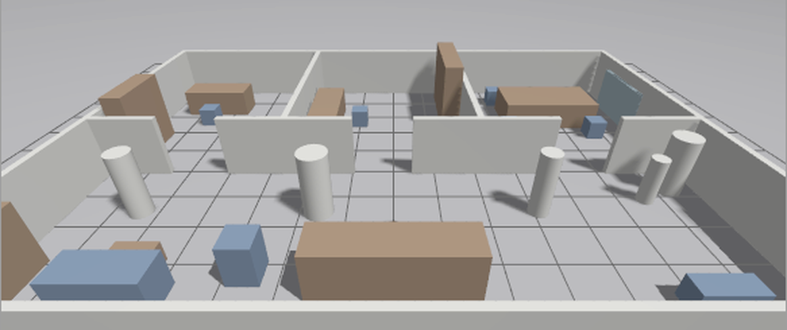
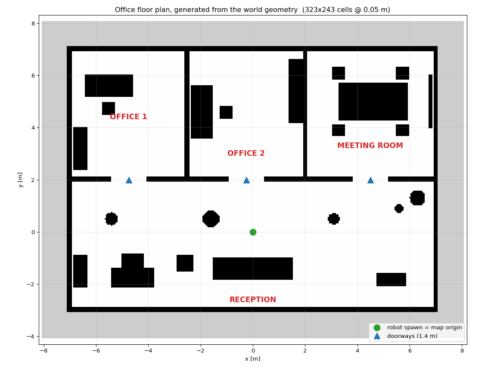
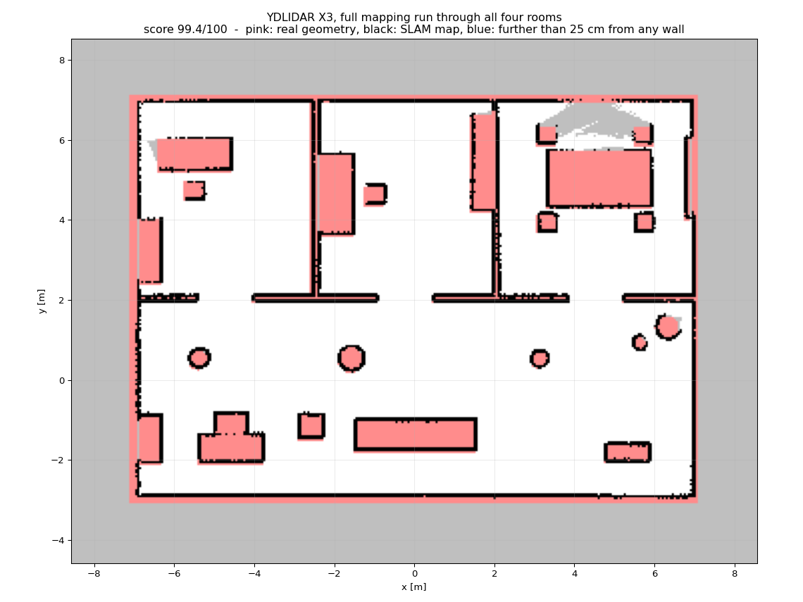
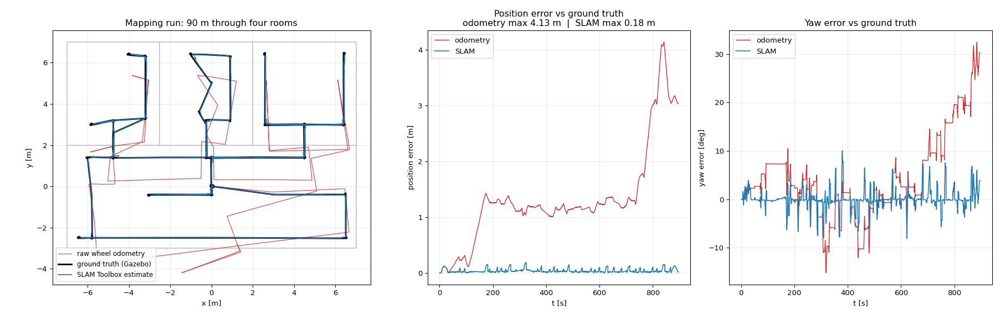
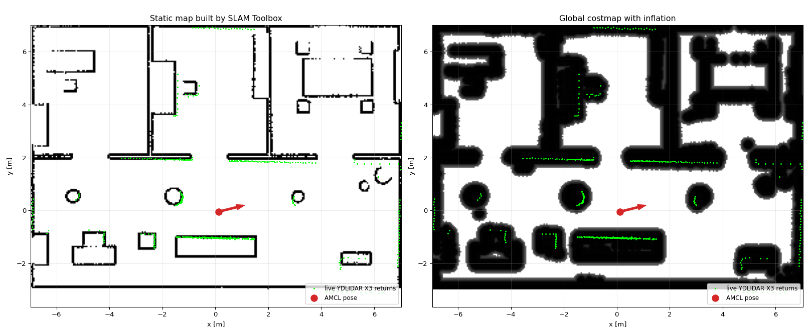
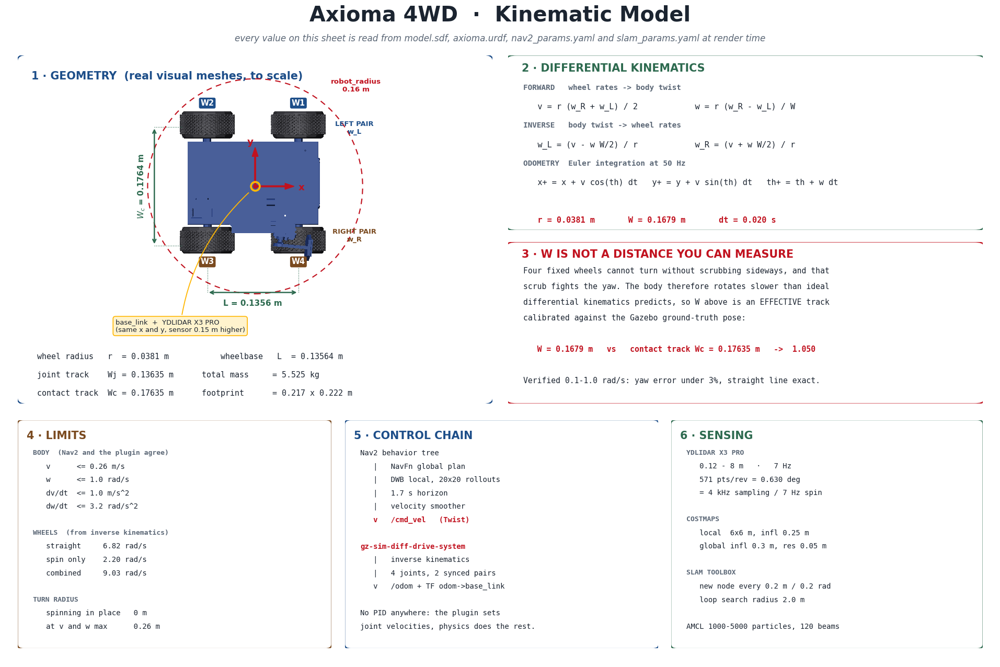

# Axioma 4WD Autonomous Mobile Robot

<div align="center">

</div>

</br>

<div align="center" width="70%">

[](#)
[](#)
[](#)
[](#)
[](#)
[](#)
[](#)
[](LICENSE)
[](https://github.com/MrDavidAlv/Axioma_robot)


</div>

---

## Quick Start

```bash
# 1. Install ROS2 Humble (Ubuntu 22.04)
sudo apt update && sudo apt install ros-humble-desktop

# 2. Install project dependencies
sudo apt install -y python3-colcon-common-extensions python3-rosdep python3-argcomplete \
                     ros-humble-ros-gz ros-humble-navigation2 ros-humble-nav2-bringup \
                     ros-humble-robot-state-publisher ros-humble-joint-state-publisher \
                     ros-humble-slam-toolbox ros-humble-teleop-twist-keyboard \
                     ros-humble-rviz2 ros-humble-xacro ros-humble-tf2-tools

# 3. Clone and build
mkdir -p ~/ros2/axioma_ws/src
cd ~/ros2/axioma_ws/src
git clone https://github.com/MrDavidAlv/Axioma_robot.git .
cd ~/ros2/axioma_ws
colcon build --symlink-install
source install/setup.bash

# 4. Launch SLAM (mapping)
ros2 launch axioma_bringup slam_bringup.launch.py

# Or launch autonomous navigation (requires a saved map)
ros2 launch axioma_bringup navigation_bringup.launch.py
```

See [Installation](#installation) and [Usage](#usage) for detailed instructions.

---

## Table of Contents

- [Quick Start](#quick-start)
- [Description](#description)
- [Features](#features)
- [Robot Gallery](#robot-gallery)
- [Video Demonstrations](#video-demonstrations)
- [System Architecture](#system-architecture)
- [Simulation Environment](#simulation-environment)
- [Mathematical Model](#mathematical-model)
- [Requirements](#requirements)
- [Installation](#installation)
- [Build](#build)
- [Usage](#usage)
- [Project Structure](#project-structure)
- [Contact](#contact)

---

## Description

This project implements autonomous navigation software using ROS2 for the **Axioma.io** mobile robot platform. The system integrates SLAM (Simultaneous Localization and Mapping) for real-time map construction, AMCL (Adaptive Monte Carlo Localization) for pose estimation, and Nav2 for trajectory planning and obstacle avoidance. The robot is designed for autonomous material transport in industrial production lines.

### Objectives

- Design a 3D simulation environment that replicates real workspaces with static and dynamic obstacles
- Equip the simulated robot with navigation sensors (LiDAR, encoders, IMU)
- Implement the ROS2 ecosystem for localization (AMCL), control (differential drive), and navigation (Nav2)
- Develop trajectory planning under kinematic constraints and obstacle avoidance
- Integrate the software stack with the physical Axioma.io robot

### Keywords

Mobile robot, autonomous navigation, industrial logistics, trajectory planning, ROS2 Humble, Ignition Gazebo Fortress, Nav2, SLAM, differential drive, skid-steering

---

## Features

<div align="center">

| Feature | Description |
|---------|-------------|
| **Real-time SLAM** | Simultaneous mapping and localization using SLAM Toolbox in asynchronous mode |
| **Autonomous Navigation** | Full Nav2 stack with global planner (NavFn/Dijkstra) and local controller (DWB) |
| **Obstacle Avoidance** | Real-time detection and evasion using a 360-degree YDLIDAR X3 PRO |
| **Teleoperation GUI** | PyQt5 graphical interface with keyboard, virtual joystick, and slider control modes |
| **Keyboard Teleoperation** | Standard teleop_twist_keyboard support for manual control during mapping |
| **Full Visualization** | RViz2 with dynamic costmaps, planned trajectories, and AMCL particle clouds |
| **4WD Differential Robot** | Robust odometry from 1000 PPR encoders with skid-steering kinematics |
| **Ignition Gazebo Simulation** | Gazebo Sim (Fortress) with the ros_gz bridge for all sensor and actuator interfaces |
| **Configurable Parameters** | All Nav2, AMCL, SLAM, and DWB parameters tunable per application |
| **Open Source** | BSD license, free for academic, research, and commercial use |

</div>

---

## Robot Gallery

<div align="center">
<table>
  <tr>
    <td></td>
    <td></td>
  </tr>
  <tr>
    <td></td>
    <td></td>
  </tr>
  <tr>
    <td></td>
    <td></td>
  </tr>
</table>
</div>

---

## Video Demonstrations

<div align="center">

[](https://www.youtube.com/watch?v=hl_HeULvuvQ)

**[Watch full demonstration on YouTube](https://www.youtube.com/watch?v=hl_HeULvuvQ)**

*Complete walkthrough: real-time SLAM, map saving, and autonomous Nav2 navigation*

</div>

> **Note:** The videos below correspond to an earlier version built with ROS2 Foxy. The core functionality remains the same in the current Humble release with improvements in performance and stability.

<div align="center">

| **Autonomous Navigation** | **SLAM and Mapping** |
|:------------------------:|:-----------------:|
| [](https://youtu.be/U28n4vSAwDk) | [](https://youtu.be/A-7UMoYXUBQ) |
| *Navigation in a mapped environment* | *Real-time mapping with LiDAR* |

| **Sensors and TF Frames** | **Mechanical Assembly** |
|:---------------------:|:-----------------:|
| [](https://youtu.be/dHnnpMOO5yg) | [](https://youtu.be/buS84GiqQug) |
| *RViz visualization and odometry* | *CAD design in Autodesk Inventor* |

| **Mercury Robotics Competition** | **Teleoperation** |
|:-----------------------------:|:--------------------------:|
| [](https://youtu.be/8E0mYynNUog) | [](https://youtu.be/sHgdL3dffgw) |
| *Axioma One at Mercury 2019* | *Teleoperation via Raspberry Pi + Flask* |

</div>

---

## System Architecture

### Transform Tree (TF)

<div align="center">

</div>

Spatial transform tree: `map -> odom -> base_link -> sensors`. The `odom_to_tf` node publishes the `odom -> base_link` transform from Gazebo odometry. AMCL publishes `map -> odom` to correct odometric drift during navigation.

### SLAM System

<div align="center">

</div>

SLAM Toolbox runs in asynchronous mode, building graph-based 2D occupancy grid maps in real time. It processes LiDAR scans at 7 Hz (571 points per revolution) and odometry at 50 Hz with pose-graph optimization and loop closure detection.

### Navigation System

<div align="center">

</div>

The Nav2 stack integrates the NavFn global planner (Dijkstra), the DWB local controller (Dynamic Window Approach), dynamic costmaps with inflation and obstacle layers, and recovery behaviors (spin, backup, wait).

---

## Simulation Environment

The simulated world is a small office floor plan built entirely from primitive
geometry (boxes and cylinders). It loads instantly and pulls nothing from Fuel,
so the simulation starts identically on any machine.

<div align="center">

</div>

| Area | Size | Contents |
|------|------|----------|
| **Reception** | 14 x 5 m | Front desk, sofa and coffee table, bench, planter, west cabinet, three columns, plant, water cooler |
| **Office 1** | 4.5 x 5 m | Desk on the north wall, chair, filing cabinet on the west wall |
| **Office 2** | 4.5 x 5 m | Desk on the west wall, chair, shelving on the east wall |
| **Meeting room** | 5 x 5 m | 2.6 m table, four chairs, whiteboard |

The three rooms open onto the reception through 1.4 m doorways, wide enough to
leave 0.8 m of zero-cost corridor once the 0.30 m costmap inflation is applied.
The columns are not decoration. They exist so that no two places in the building
look alike to the LiDAR: their radii and spacing are deliberately irregular, and
the two offices are furnished differently from each other. An environment that
repeats itself feeds the pose graph false loop closures, and the map comes out
with duplicated walls. See [SLAM quality](#slam-quality) for the measurements.

### One source of truth for the world and its floor plan

`src/axioma_gazebo/scripts/generate_office_world.py` emits **both** the Gazebo
world and an exact occupancy grid of it from the same geometry list, so the two
can never drift apart:

```bash
python3 src/axioma_gazebo/scripts/generate_office_world.py
# -> src/axioma_gazebo/worlds/office.world
# -> src/axioma_navigation/maps/ground_truth.{pgm,yaml}
```

Only geometry taller than the LiDAR plane (0.15 m) is rasterised as an obstacle,
and free space is flood-filled from the spawn point, so everything outside the
building stays unknown - the same structure a real mapping run produces.

`ground_truth` is **not** the map Nav2 navigates with. That one
(`maps/mapa.yaml`) is produced by driving the robot around with SLAM Toolbox
running, exactly as you would on the real robot. The exact plan exists so the
quality of the SLAM map can be measured instead of eyeballed.

<div align="center">

</div>

### SLAM quality

`src/axioma_slam/scripts/score_map.py` compares the SLAM map against that exact
plan and reports two numbers: how far each occupied cell of the SLAM map is from
the nearest real obstacle (how much of the map is invented), and how many real
obstacles inside explored territory the map actually marks.

```bash
python3 src/axioma_slam/scripts/score_map.py --saved out.png "run title"
```

Result for the shipped map, after a 90 m run through all four rooms:

| Metric | Value |
|--------|-------|
| Occupied cells within 10 cm of a real obstacle | **100.0 %** |
| Occupied cells further than 50 cm (invented) | **0.0 %** |
| Real obstacles found within 10 cm | **99.8 %** |
| **Score** (precision@10cm x recall@10cm) | **99.8 / 100** |

<div align="center">

</div>

Pink is the real geometry, black is the SLAM map. There is no blue, meaning no
occupied cell sits more than 25 cm from a real wall.

The pose graph has to work for it: raw wheel odometry drifts to **3.79 m** over
the run, while SLAM Toolbox stays within **0.14 m** of the Gazebo ground-truth
pose the whole time, with no jumps.

<div align="center">

</div>

### Localisation check

Live laser returns (green) projected onto the SLAM map and onto the inflated
global costmap, with the AMCL pose in red. They land on the walls, the reception
desk and the columns, confirming that the world, the map and the pose estimate
all agree.

<div align="center">

</div>

---

## Mathematical Model

<div align="center">

</div>

4WD skid-steer kinematics, the control chain, and where every limit is enforced.
The robot is drawn from its actual visual meshes in orthographic projection, and
every number on the sheet is read from `model.sdf`, `axioma.urdf`,
`nav2_params.yaml` and `slam_params.yaml` when the figure is rendered, so it
cannot drift out of date:

```bash
python3 documentacion/modelo-matematico/render_diagram.py
```

Full write-up in [`documentacion/modelo-matematico/`](documentacion/modelo-matematico/).

### Key Parameters

| Parameter | Value |
|-----------|-------|
| Wheel radius | $r = 0.0381$ m |
| Joint track | $W_j = 0.13635$ m |
| Contact track | $W_c = 0.17635$ m |
| **Effective track (used by the model)** | $W = 0.1679$ m |
| Wheelbase | $L = 0.13564$ m |
| Total mass | $m = 5.525$ kg |
| Max linear velocity | $v_{max} = 0.26$ m/s |
| Max angular velocity | $\omega_{max} = 1.0$ rad/s |
| Max linear acceleration | $a_{max} = 1.0$ m/s² |
| Max angular acceleration | $\alpha_{max} = 3.2$ rad/s² |

**Differential kinematics:**

$$v = \frac{r(\omega_R + \omega_L)}{2}, \quad \omega = \frac{r(\omega_R - \omega_L)}{W}$$

$W$ is **not** a distance you can measure on the robot. Four fixed wheels cannot
turn without scrubbing sideways, and that scrub fights the yaw: with the
geometric track the robot rotated about **65 %** of what the odometry believed,
and the error varied with speed. The fix is anisotropic wheel friction plus an
effective track calibrated against the Gazebo ground-truth pose, which brings
yaw error under 3 % from 0.1 to 1.0 rad/s.

---

## Requirements

### Software

- **Operating System**: Ubuntu 22.04 LTS
- **ROS2**: Humble Hawksbill
- **Gazebo**: Ignition Fortress (gz-sim 6) — the version `ros-humble-ros-gz` is built against
- **Python**: 3.8+
- **CMake**: 3.16+

### ROS2 Dependencies

```
ros-humble-ros-gz              # Ignition Fortress integration
ros-humble-navigation2         # Full Nav2 stack
ros-humble-slam-toolbox        # SLAM mapping
ros-humble-rviz2               # Visualization
ros-humble-teleop-twist-keyboard   # Keyboard teleoperation
ros-humble-robot-state-publisher   # URDF TF publishing
ros-humble-tf2-tools           # TF debugging utilities
```

### Recommended Hardware

- **CPU**: Intel i5 8th Gen / AMD Ryzen 5 or higher (4+ cores)
- **RAM**: 8 GB minimum, 16 GB recommended
- **Storage**: 10 GB free disk space

---

## Installation

### 1. Install ROS2 Humble

```bash
# Configure locale and repository
sudo apt update && sudo apt install locales curl
sudo locale-gen en_US en_US.UTF-8
sudo curl -sSL https://raw.githubusercontent.com/ros/rosdistro/master/ros.key \
  -o /usr/share/keyrings/ros-archive-keyring.gpg
echo "deb [arch=$(dpkg --print-architecture) signed-by=/usr/share/keyrings/ros-archive-keyring.gpg] \
  http://packages.ros.org/ros2/ubuntu $(. /etc/os-release && echo $UBUNTU_CODENAME) main" \
  | sudo tee /etc/apt/sources.list.d/ros2.list > /dev/null

# Install ROS2 Humble Desktop
sudo apt update && sudo apt upgrade
sudo apt install ros-humble-desktop
```

### 2. Install Ignition Gazebo Fortress

```bash
sudo apt install ignition-fortress ros-humble-ros-gz
```

> The Humble binaries of `ros_gz` are built against Fortress (gz-sim 6). Installing
> Gazebo Harmonic alongside will not change which simulator the launch files start.

### 3. Install Project Dependencies

```bash
sudo apt install -y \
  python3-colcon-common-extensions python3-rosdep \
  ros-humble-navigation2 ros-humble-nav2-bringup \
  ros-humble-slam-toolbox ros-humble-rviz2 \
  ros-humble-teleop-twist-keyboard ros-humble-joy \
  ros-humble-robot-state-publisher ros-humble-tf2-tools

sudo rosdep init && rosdep update
```

### 4. Clone the Repository

```bash
mkdir -p ~/ros2/axioma_ws/src
cd ~/ros2/axioma_ws/src
git clone https://github.com/MrDavidAlv/Axioma_robot.git .
```

---

## Build

```bash
cd ~/ros2/axioma_ws
colcon build --symlink-install
source install/setup.bash
```

To automatically source the workspace on every new terminal:

```bash
echo "source ~/ros2/axioma_ws/install/setup.bash" >> ~/.bashrc
```

---

## Usage

### SLAM (Mapping)

Launch the simulation with SLAM Toolbox and RViz:

```bash
ros2 launch axioma_bringup slam_bringup.launch.py
```

In a separate terminal, control the robot to explore the environment:

```bash
ros2 run teleop_twist_keyboard teleop_twist_keyboard
```

Or use the graphical teleoperation interface:

```bash
ros2 launch axioma_teleop_gui teleop_gui.launch.py
```

Save the map once the environment has been fully explored:

```bash
ros2 launch axioma_slam save_map.launch.py
```

With the workspace built using `--symlink-install` this writes straight into
`src/axioma_navigation/maps/mapa.{pgm,yaml}`, so the map stays under version
control instead of being overwritten by the next build. Check how good it came
out with:

```bash
python3 src/axioma_slam/scripts/score_map.py
```

### Autonomous Navigation

Launch the simulation with Nav2 and RViz (requires a previously saved map):

```bash
ros2 launch axioma_bringup navigation_bringup.launch.py
```

In RViz2:

1. Use **2D Pose Estimate** to set the robot initial pose
2. Use **2D Goal Pose** to send a navigation goal
3. Monitor the global/local costmaps, planned paths, and AMCL particle distribution

### Useful Commands

```bash
# Monitoring
ros2 node list                           # Active nodes
ros2 topic list                          # Active topics
ros2 topic hz /scan                      # LiDAR frequency
ros2 topic echo /cmd_vel                 # Velocity commands
ros2 run tf2_ros tf2_echo map base_link  # TF lookup
ros2 run tf2_tools view_frames           # TF tree diagram

# Debugging
ros2 node info /slam_toolbox
ros2 param list /controller_server
ros2 bag record -a -o navigation_data
```

---

## Project Structure

```
Axioma_robot/
├── src/
│   ├── axioma_bringup/            # Top-level launch orchestrators
│   │   └── launch/
│   │       ├── slam_bringup.launch.py
│   │       └── navigation_bringup.launch.py
│   │
│   ├── axioma_description/        # URDF model, meshes, RViz configs
│   │   ├── urdf/
│   │   ├── meshes/
│   │   ├── rviz/
│   │   └── launch/
│   │
│   ├── axioma_gazebo/             # Ignition Gazebo (Fortress) simulation
│   │   ├── axioma_gazebo/
│   │   │   └── odom_to_tf.py      # Odometry to TF broadcaster
│   │   ├── models/axioma_v2/      # SDF model with meshes
│   │   ├── scripts/
│   │   │   └── generate_office_world.py   # Emits world + Nav2 map together
│   │   ├── worlds/
│   │   │   ├── office.world       # Reception, 2 offices, meeting room
│   │   │   └── empty.world
│   │   └── launch/
│   │       └── simulation.launch.py
│   │
│   ├── axioma_slam/               # SLAM Toolbox configuration
│   │   ├── config/
│   │   │   └── slam_params.yaml
│   │   ├── scripts/
│   │   │   └── score_map.py       # Scores a SLAM map against ground truth
│   │   ├── rviz/
│   │   └── launch/
│   │       ├── slam.launch.py
│   │       └── save_map.launch.py
│   │
│   ├── axioma_navigation/         # Nav2 configuration and maps
│   │   ├── config/
│   │   │   └── nav2_params.yaml
│   │   ├── maps/
│   │   ├── rviz/
│   │   └── launch/
│   │       └── navigation.launch.py
│   │
│   └── axioma_teleop_gui/         # PyQt5 teleoperation interface
│       ├── axioma_teleop_gui/
│       │   ├── main.py
│       │   ├── main_window.py
│       │   ├── ros_node.py
│       │   └── widgets/
│       │       ├── keyboard_mode.py
│       │       ├── joystick_mode.py
│       │       └── slider_mode.py
│       └── launch/
│           └── teleop_gui.launch.py
│
├── documentacion/
│   └── modelo-matematico/         # Kinematic and control documentation
│
├── images/                        # Documentation images
└── README.md
```

---

## Physical Parameters

| Parameter | Value | Source |
|-----------|-------|--------|
| Total mass | 5.525 kg | SDF model |
| Footprint (L x W x H) | 0.217 x 0.222 x 0.155 m | Visual meshes |
| Circumscribed radius | 0.158 m (robot_radius 0.16) | Visual meshes |
| Wheelbase x contact track | 0.1356 x 0.17635 m | Joint origins |
| Effective track (plugin) | 0.1679 m, calibrated | model.sdf |
| Wheel radius | 0.0381 m | model.sdf |
| Wheel friction | mu 0.05 lateral, mu2 1.0 rolling, fdir1 on the axle | model.sdf |
| Max linear acceleration | 1.0 m/s^2 | model.sdf, nav2_params.yaml |
| Max angular acceleration | 3.2 rad/s^2 | model.sdf, nav2_params.yaml |
| LiDAR (YDLIDAR X3 PRO) | 360 deg, 0.12-8 m, 40 klux, 4 kHz ranging | model.sdf |
| LiDAR scan rate | 5-10 Hz adjustable, simulated at 7 Hz | model.sdf |
| LiDAR angular resolution | 0.630 deg = 4 kHz ranging / 7 Hz scan rate | model.sdf |

---

## Contact

**Author**: Mario David Alvarez Vallejo
**Repository**: [github.com/MrDavidAlv/Axioma_robot](https://github.com/MrDavidAlv/Axioma_robot)
**License**: BSD -- Free for academic and research use
