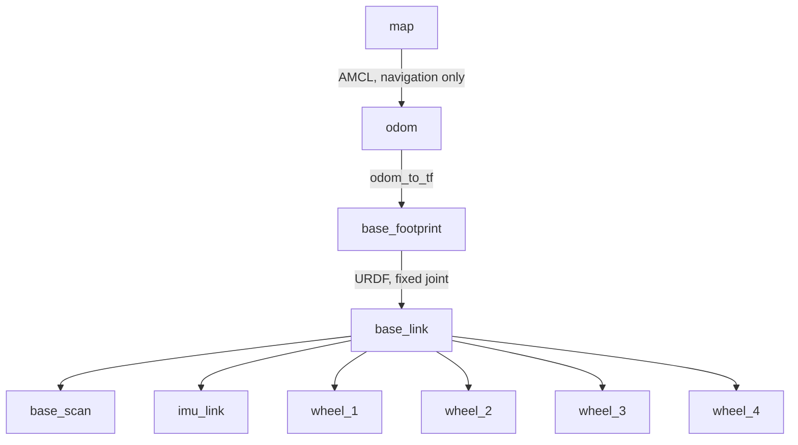
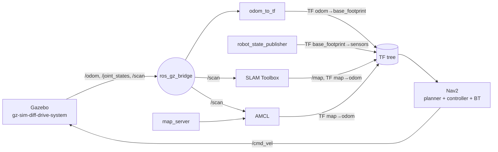

# Axioma 4WD Autonomous Mobile Robot

<div align="center">

</div>

</br>

<div align="center" width="70%">

[](#)
[](#)
[](#)
[](#)
[](#)
[](#)
[](#)
[](LICENSE)
[](https://github.com/MrDavidAlv/Axioma_robot)


</div>

---

## Quick Start

```bash
# 1. Install ROS2 Humble (Ubuntu 22.04)
sudo apt update && sudo apt install ros-humble-desktop

# 2. Install project dependencies
sudo apt install -y python3-colcon-common-extensions python3-rosdep python3-argcomplete \
                     ros-humble-ros-gz ros-humble-navigation2 ros-humble-nav2-bringup \
                     ros-humble-robot-state-publisher ros-humble-joint-state-publisher \
                     ros-humble-slam-toolbox ros-humble-teleop-twist-keyboard \
                     ros-humble-rviz2 ros-humble-xacro ros-humble-tf2-tools

# 3. Clone and build
mkdir -p ~/ros2/axioma_ws/src
cd ~/ros2/axioma_ws/src
git clone https://github.com/MrDavidAlv/Axioma_robot.git .
cd ~/ros2/axioma_ws
colcon build --symlink-install
source install/setup.bash

# 4. Launch SLAM (mapping)
ros2 launch axioma_bringup slam_bringup.launch.py

# Or launch autonomous navigation (requires a saved map)
ros2 launch axioma_bringup navigation_bringup.launch.py
```

Full steps, including Gazebo, in the **[Installation Guide](documentacion/guia-instalacion.md)**.
Everything the robot can do, in the **[Usage Guide](documentacion/guia-uso.md)**.

---

## Table of Contents

- [Quick Start](#quick-start)
- [Description](#description)
- [Features](#features)
- [Mathematical Model](#mathematical-model)
- [System Architecture](#system-architecture)
- [Simulation Environment](#simulation-environment)
- [SLAM Validation](#slam-validation)
- [Physical Robot](#physical-robot)
- [Video Demonstrations](#video-demonstrations)
- [Installation](#installation)
- [Usage](#usage)
- [Project Structure](#project-structure)
- [Contact](#contact)

---

## Description

Axioma is a 4WD skid-steer mobile robot built for autonomous material
transport on industrial production lines. This repository is its ROS 2 stack:
SLAM Toolbox for real-time mapping, AMCL for localisation against a saved map,
and Nav2 for planning and obstacle avoidance around it — all developed and
validated in a Gazebo simulation of an actual office floor plan before ever
touching the physical robot.

What it covers, end to end:

- A 3D simulation environment with static obstacles, matching a real workspace
- Simulated navigation sensors — LiDAR, wheel encoders — wired the same way
  the physical robot's are
- Localisation (AMCL), differential/skid-steer control, and planning (Nav2)
  built on the standard ROS 2 navigation stack
- Trajectory planning under the robot's actual kinematic and dynamic limits
- A software stack meant to move to the physical Axioma.io robot with no
  redesign, only recalibration

---

## Features

<div align="center">

| Feature | Description |
|---------|-------------|
| **Real-time SLAM** | Simultaneous mapping and localization using SLAM Toolbox in asynchronous mode |
| **Autonomous Navigation** | Full Nav2 stack with global planner (NavFn/Dijkstra) and local controller (DWB) |
| **Obstacle Avoidance** | Real-time detection and evasion using a 360-degree YDLIDAR X3 PRO |
| **Teleoperation GUI** | PyQt5 graphical interface with keyboard, virtual joystick, and slider control modes |
| **Keyboard Teleoperation** | Standard teleop_twist_keyboard support for manual control during mapping |
| **Full Visualization** | RViz2 with dynamic costmaps, planned trajectories, and AMCL particle clouds |
| **4WD Differential Robot** | Robust odometry from 1000 PPR encoders with skid-steering kinematics |
| **Ignition Gazebo Simulation** | Gazebo Sim (Fortress) with the ros_gz bridge for all sensor and actuator interfaces |
| **Configurable Parameters** | All Nav2, AMCL, SLAM, and DWB parameters tunable per application |
| **Open Source** | BSD license, free for academic, research, and commercial use |

</div>

---

## Mathematical Model

<div align="center">

</div>

4WD skid-steer kinematics, the control chain, and where every limit is
enforced. The robot is drawn from its actual visual meshes in orthographic
projection, and every number on the sheet is read from `model.sdf`,
`axioma.urdf`, `nav2_params.yaml` and `slam_params.yaml` when the figure is
rendered, so it cannot drift out of date:

```bash
python3 documentacion/modelo-matematico/render_diagram.py
```

**Differential kinematics:**

$$v = \frac{r(\omega_R + \omega_L)}{2}, \quad \omega = \frac{r(\omega_R - \omega_L)}{W}$$

$W$ is **not** a distance you can measure on the robot. Four fixed wheels
cannot turn without scrubbing sideways, and that scrub fights the yaw: with
the geometric track the robot rotated about **65 %** of what the odometry
believed, and the error varied with speed. The fix is anisotropic wheel
friction plus an effective track calibrated against the Gazebo ground-truth
pose, which brings yaw error under 3 % from 0.1 to 1.0 rad/s.

| Parameter | Value |
|-----------|-------|
| Wheel radius | $r = 0.0381$ m |
| **Effective track (used by the model)** | $W = 0.1679$ m |
| Wheelbase | $L = 0.13564$ m |
| Total mass | $m = 5.525$ kg |
| Max linear / angular velocity | $v_{max} = 0.26$ m/s, $\omega_{max} = 1.0$ rad/s |
| Max linear / angular acceleration | $a_{max} = 1.0$ m/s², $\alpha_{max} = 3.2$ rad/s² |

Full write-up — geometry, direct/inverse kinematics, the control chain, every
parameter with its source — in
**[`documentacion/modelo-matematico/`](documentacion/modelo-matematico/)**.

---

## System Architecture

### Transform tree

`base_footprint` is the ground projection of `base_link` and the root of the
URDF. It carries no inertia, which is what KDL needs from a root link, and it
is the frame `odom_to_tf` attaches Gazebo odometry to. `base_link` hangs
2.58 mm below it, because the wheel centres sit at z = 0.04068 while the
wheels have radius 0.0381.


```mermaid
graph TD
    map -->|AMCL, navigation only| odom
    odom -->|odom_to_tf| base_footprint
    base_footprint -->|URDF, fixed joint| base_link
    base_link --> base_scan
    base_link --> imu_link
    base_link --> wheel_1
    base_link --> wheel_2
    base_link --> wheel_3
    base_link --> wheel_4
```

### Data flow

SLAM Toolbox and AMCL both publish `map -> odom`, but never at the same time —
mapping and navigation are separate launches. Everything below `odom` is
always live, driven by `robot_state_publisher` and `odom_to_tf`.


```mermaid
flowchart LR
    GZ["Gazebo\ngz-sim-diff-drive-system"] -- "/odom, /joint_states, /scan" --> BR(("ros_gz_bridge"))
    BR --> OTF["odom_to_tf"]
    OTF -- "TF odom→base_footprint" --> TF[("TF tree")]
    RSP["robot_state_publisher"] -- "TF base_footprint→sensors" --> TF

    BR -- "/scan" --> SLAM["SLAM Toolbox"]
    SLAM -- "/map, TF map→odom" --> TF

    MS["map_server"] --> AMCL
    BR -- "/scan" --> AMCL["AMCL"]
    AMCL -- "TF map→odom" --> TF
    TF --> NAV["Nav2\nplanner + controller + BT"]
    NAV -- "/cmd_vel" --> GZ
```

SLAM Toolbox runs in asynchronous mode, building graph-based 2D occupancy grid
maps in real time from LiDAR scans at 10 Hz (400 points per revolution) and
odometry at 50 Hz, with pose-graph optimization and loop closure detection.
The Nav2 stack on the navigation side integrates the NavFn global planner
(Dijkstra), the DWB local controller (Dynamic Window Approach), dynamic
costmaps with inflation and obstacle layers, and recovery behaviors (spin,
backup, wait).

---

## Simulation Environment

The simulated world is a small office floor plan built entirely from primitive
geometry (boxes and cylinders). It loads instantly and pulls nothing from Fuel,
so the simulation starts identically on any machine.

<div align="center">

</div>

| Area | Size | Contents |
|------|------|----------|
| **Reception** | 14 x 5 m | Front desk, sofa and coffee table, bench, planter, west cabinet, three columns, plant, water cooler |
| **Office 1** | 4.5 x 5 m | Desk on the north wall, chair, filing cabinet on the west wall |
| **Office 2** | 4.5 x 5 m | Desk on the west wall, chair, shelving on the east wall |
| **Meeting room** | 5 x 5 m | 2.6 m table, four chairs, whiteboard |

The three rooms open onto the reception through 1.4 m doorways, wide enough to
leave 0.8 m of zero-cost corridor once the 0.30 m costmap inflation is applied.
The columns are not decoration: they exist so that no two places in the
building look alike to the LiDAR, and the two offices are furnished
differently from each other. An environment that repeats itself feeds the
pose graph false loop closures, and the map comes out with duplicated walls.

`src/axioma_gazebo/scripts/generate_office_world.py` emits **both** the
Gazebo world and an exact occupancy grid of it from the same geometry list, so
the two can never drift apart — see
**[SLAM Validation](#slam-validation)** for what that buys.

<div align="center">

</div>

---

## SLAM Validation

`src/axioma_slam/scripts/score_map.py` compares the SLAM map against the exact
floor plan above and reports how far each occupied cell is from the nearest
real obstacle (how much of the map is invented), and how many real obstacles
inside explored territory the map actually marks.

Result for the shipped map, after a 90 m run through all four rooms:

| Metric | Value |
|--------|-------|
| Occupied cells within 10 cm of a real obstacle | **100.0 %** |
| Occupied cells further than 50 cm (invented) | **0.0 %** |
| Real obstacles found within 10 cm | **99.8 %** |
| **Score** (precision@10cm x recall@10cm) | **99.8 / 100** |

<div align="center">

</div>

Pink is the real geometry, black is the SLAM map. There is no blue, meaning no
occupied cell sits more than 25 cm from a real wall. Raw wheel odometry drifts
to 3.79 m over the same run, while SLAM Toolbox stays within 0.14 m of the
Gazebo ground-truth pose throughout.

Odometry-vs-SLAM telemetry and the live localisation cross-check are in
**[SLAM Validation, full write-up](documentacion/validacion-slam.md)**.

---

## Physical Robot

<div align="center">
<table>
  <tr>
    <td></td>
    <td></td>
  </tr>
</table>
</div>

Build photos and the CAD/assembly videos are in
**[Project History](documentacion/historial-proyecto.md)**.

---

## Video Demonstrations

<div align="center">

[](https://www.youtube.com/watch?v=hl_HeULvuvQ)

**[Watch full demonstration on YouTube](https://www.youtube.com/watch?v=hl_HeULvuvQ)**

*Complete walkthrough: real-time SLAM, map saving, and autonomous Nav2 navigation*

</div>

Earlier recordings from the ROS 2 Foxy version of this project — navigation,
SLAM, sensor/TF visualization, mechanical assembly — are in
**[Project History](documentacion/historial-proyecto.md)**.

---

## Installation

- **OS**: Ubuntu 22.04 LTS · **ROS 2**: Humble · **Gazebo**: Ignition Fortress
  (gz-sim 6) · **Python**: 3.8+

Full requirements, the Gazebo install, and every dependency in the
**[Installation Guide](documentacion/guia-instalacion.md)**.

---

## Usage

The Quick Start above covers launching SLAM and Navigation. For exploring
with `teleop_twist_keyboard` or the GUI, saving and scoring a map, running the
physical YDLIDAR X3 PRO, and a reference list of useful `ros2` commands, see
the **[Usage Guide](documentacion/guia-uso.md)**.

---

## Project Structure

Package layout — launch files, configs, scripts — is in
**[Project Structure](documentacion/estructura-proyecto.md)**.

---

## Contact

**Author**: Mario David Alvarez Vallejo
**Repository**: [github.com/MrDavidAlv/Axioma_robot](https://github.com/MrDavidAlv/Axioma_robot)
**License**: BSD -- Free for academic and research use
