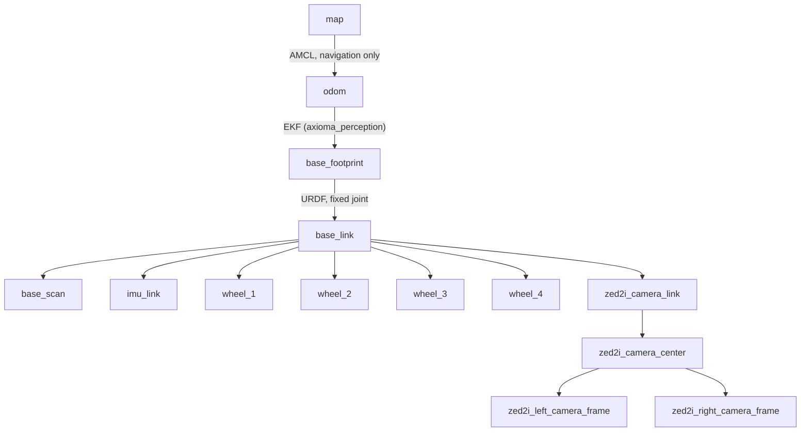
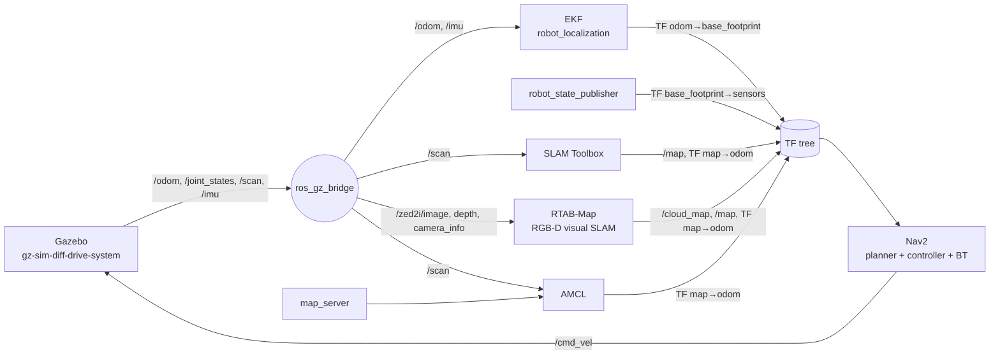
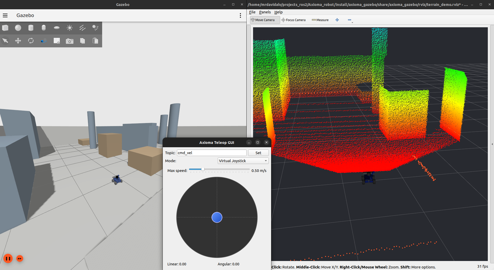

# Axioma 4WD Autonomous Mobile Robot

<div align="center">

</div>

</br>

<div align="center" width="70%">

[](#)
[](#)
[](#)
[](#)
[](#)
[](#)
[](#)
[](LICENSE)
[](https://github.com/MrDavidAlv/Axioma_robot)


</div>

---

## Quick Start

```bash
# 1. Install ROS2 Humble (Ubuntu 22.04)
sudo apt update && sudo apt install ros-humble-desktop

# 2. Install project dependencies
sudo apt install -y python3-colcon-common-extensions python3-rosdep python3-argcomplete \
                     ros-humble-ros-gz ros-humble-navigation2 ros-humble-nav2-bringup \
                     ros-humble-robot-state-publisher ros-humble-joint-state-publisher \
                     ros-humble-slam-toolbox ros-humble-teleop-twist-keyboard \
                     ros-humble-rviz2 ros-humble-xacro ros-humble-tf2-tools \
                     ros-humble-robot-localization ros-humble-rtabmap-ros

# 3. Clone and build
mkdir -p ~/ros2/axioma_ws/src
cd ~/ros2/axioma_ws/src
git clone https://github.com/MrDavidAlv/Axioma_robot.git .
cd ~/ros2/axioma_ws
colcon build --symlink-install
source install/setup.bash

# 4. Launch SLAM (mapping)
ros2 launch axioma_bringup slam_bringup.launch.py

# Or launch autonomous navigation (requires a saved map)
ros2 launch axioma_bringup navigation_bringup.launch.py

# Or launch RGB-D visual SLAM, mapping in 3D with the ZED 2i
ros2 launch axioma_bringup vslam_bringup.launch.py
```

Full steps, including Gazebo, in the **[Installation Guide](documentacion/guia-instalacion.md)**.
Everything the robot can do, in the **[Usage Guide](documentacion/guia-uso.md)**.

---

## Table of Contents

- [Quick Start](#quick-start)
- [Description](#description)
- [Features](#features)
- [Mathematical Model](#mathematical-model)
- [System Architecture](#system-architecture)
- [Simulation Environment](#simulation-environment)
- [Visual SLAM](#visual-slam)
- [SLAM Validation](#slam-validation)
- [Physical Robot](#physical-robot)
- [Video Demonstrations](#video-demonstrations)
- [Installation](#installation)
- [Usage](#usage)
- [Project Structure](#project-structure)
- [Contact](#contact)

---

## Description

Axioma is a 4WD skid-steer mobile robot built for autonomous material
transport on industrial production lines. This repository is its ROS 2 stack:
SLAM Toolbox for real-time mapping, AMCL for localisation against a saved map,
and Nav2 for planning and obstacle avoidance around it — all developed and
validated in a Gazebo simulation of an actual office floor plan before ever
touching the physical robot.

What it covers, end to end:

- A 3D simulation environment with static obstacles, matching a real workspace
- Simulated navigation sensors — LiDAR, wheel encoders, IMU, ZED 2i stereo
  depth camera — wired the same way the physical robot's are
- Localisation (AMCL), differential/skid-steer control, and planning (Nav2)
  built on the standard ROS 2 navigation stack
- Trajectory planning under the robot's actual kinematic and dynamic limits
- A software stack meant to move to the physical Axioma.io robot with no
  redesign, only recalibration

---

## Features

<div align="center">

| Feature | Description |
|---------|-------------|
| **Real-time SLAM** | Simultaneous mapping and localization using SLAM Toolbox in asynchronous mode |
| **Autonomous Navigation** | Full Nav2 stack with global planner (NavFn/Dijkstra) and local controller (DWB) |
| **Obstacle Avoidance** | Real-time detection and evasion using a 360-degree YDLIDAR X3 PRO |
| **Teleoperation GUI** | PyQt5 graphical interface with keyboard, virtual joystick, and slider control modes |
| **Keyboard Teleoperation** | Standard teleop_twist_keyboard support for manual control during mapping |
| **Full Visualization** | RViz2 with dynamic costmaps, planned trajectories, and AMCL particle clouds |
| **4WD Differential Robot** | Robust odometry from 1000 PPR encoders with skid-steering kinematics |
| **Attitude-Aware Odometry** | EKF (robot_localization) fusing a chassis IMU so the pose follows slopes instead of assuming flat ground |
| **Stereo Depth Camera** | ZED 2i on the front face, feeding visual-inertial pose to the EKF on the physical robot |
| **RGB-D Visual SLAM** | RTAB-Map building a 3D map and a Nav2-ready occupancy grid from the ZED 2i, with camera-only odometry or the fused EKF pose as the motion source |
| **Ignition Gazebo Simulation** | Gazebo Sim (Fortress) with the ros_gz bridge for all sensor and actuator interfaces |
| **Configurable Parameters** | All Nav2, AMCL, SLAM, and DWB parameters tunable per application |
| **Open Source** | BSD license, free for academic, research, and commercial use |

</div>

---

## Mathematical Model

<div align="center">

</div>

4WD skid-steer kinematics, the control chain, and where every limit is
enforced. The robot is drawn from its actual visual meshes in orthographic
projection, and every number on the sheet is read from `model.sdf`,
`axioma.urdf`, `nav2_params.yaml` and `slam_params.yaml` when the figure is
rendered, so it cannot drift out of date:

```bash
python3 documentacion/modelo-matematico/render_diagram.py
```

**Differential kinematics:**

$$v = \frac{r(\omega_R + \omega_L)}{2}, \quad \omega = \frac{r(\omega_R - \omega_L)}{W}$$

$W$ is **not** a distance you can measure on the robot. Four fixed wheels
cannot turn without scrubbing sideways, and that scrub fights the yaw: with
the geometric track the robot rotated about **65 %** of what the odometry
believed, and the error varied with speed. The fix is anisotropic wheel
friction plus an effective track calibrated against the Gazebo ground-truth
pose, which brings yaw error under 3 % from 0.1 to 1.0 rad/s.

| Parameter | Value |
|-----------|-------|
| Wheel radius | $r = 0.0381$ m |
| **Effective track (used by the model)** | $W = 0.1679$ m |
| Wheelbase | $L = 0.13564$ m |
| Total mass | $m = 5.525$ kg |
| Max linear / angular velocity | $v_{max} = 0.26$ m/s, $\omega_{max} = 1.0$ rad/s |
| Max linear / angular acceleration | $a_{max} = 1.0$ m/s², $\alpha_{max} = 3.2$ rad/s² |

Full write-up — geometry, direct/inverse kinematics, the control chain, every
parameter with its source — in
**[`documentacion/modelo-matematico/`](documentacion/modelo-matematico/)**.

---

## System Architecture

### Transform tree

`base_footprint` is the ground projection of `base_link` and the root of the
URDF. It carries no inertia, which is what KDL needs from a root link, and it
is the frame `odom` attaches to. `base_link` hangs 2.58 mm below it, because
the wheel centres sit at z = 0.04068 while the wheels have radius 0.0381.

`odom -> base_footprint` has exactly one publisher, chosen by the `use_ekf`
argument of `simulation.launch.py`: the EKF in `axioma_perception` by default,
or `odom_to_tf` — which republishes the wheel plugin's odometry verbatim — when
`use_ekf:=false`. Never both; a frame gets one parent.

The description is a **xacro**, not plain URDF, because the ZED 2i contributes
eight frames whose offsets come from the camera's geometry. Anything loading it
has to render it first; `open(...).read()` yields a document full of `${...}`
that KDL rejects.


```mermaid
graph TD
    map -->|AMCL, navigation only| odom
    odom -->|"EKF (axioma_perception)"| base_footprint
    base_footprint -->|URDF, fixed joint| base_link
    base_link --> base_scan
    base_link --> imu_link
    base_link --> wheel_1
    base_link --> wheel_2
    base_link --> wheel_3
    base_link --> wheel_4
    base_link --> zed2i_camera_link
    zed2i_camera_link --> zed2i_camera_center
    zed2i_camera_center --> zed2i_left_camera_frame
    zed2i_camera_center --> zed2i_right_camera_frame
```

### Data flow

SLAM Toolbox, AMCL and RTAB-Map all publish `map -> odom`, but never at the
same time — mapping, navigation and visual SLAM are separate launches.
Everything below `odom` is always live, driven by `robot_state_publisher` and
whichever node owns `odom -> base_footprint`: the EKF by default, or the visual
odometry when `vslam_bringup` runs with `odom_source:=visual`.


```mermaid
flowchart LR
    GZ["Gazebo\ngz-sim-diff-drive-system"] -- "/odom, /joint_states, /scan, /imu" --> BR(("ros_gz_bridge"))
    BR -- "/odom, /imu" --> EKF["EKF\nrobot_localization"]
    EKF -- "TF odom→base_footprint" --> TF[("TF tree")]
    RSP["robot_state_publisher"] -- "TF base_footprint→sensors" --> TF

    BR -- "/scan" --> SLAM["SLAM Toolbox"]
    SLAM -- "/map, TF map→odom" --> TF

    BR -- "/zed2i/image, depth, camera_info" --> RTAB["RTAB-Map\nRGB-D visual SLAM"]
    RTAB -- "/cloud_map, /map, TF map→odom" --> TF

    MS["map_server"] --> AMCL
    BR -- "/scan" --> AMCL["AMCL"]
    AMCL -- "TF map→odom" --> TF
    TF --> NAV["Nav2\nplanner + controller + BT"]
    NAV -- "/cmd_vel" --> GZ
```

### Attitude-aware localization

Axioma is a rigid 4WD skid-steer with no suspension. It cannot climb what a
rocker-bogie rover climbs, and no amount of software changes that. What software
*can* fix is the robot's idea of where it is while the ground is not flat.

The wheel plugin integrates rotation on the assumption that the world is a
plane, because a wheel encoder cannot tell "forward" from "up". `axioma_perception`
answers that question with a sensor that can: the chassis IMU sees gravity, so
roll and pitch are measured rather than assumed, and the EKF integrates the
wheels' forward speed through that attitude instead of through an assumed-flat
world.

Measured in the terrain world, driving straight out of the warehouse, up the
8.21° north ramp and onto the yard platform:

| | ground truth | wheel odometry | EKF |
|---|---|---|---|
| z on the platform | 0.280 m | 0.000 m (**−280 mm**) | 0.286 m (+6 mm) |
| pitch on the ramp | −8.21° | 0.00° | −8.21° |

The raw odometry reports the distance travelled along the slope as horizontal
distance and misses the climb entirely — it ends the run convinced the robot is
still on the warehouse floor. On flat ground the two agree to within 3 mm over
4 m, so the filter costs nothing where it is not needed.

The split — attitude from the IMU, position and heading from the odometry
source — is taken from [ros2_rover](https://github.com/mgonzs13/ros2_rover).
Yaw is deliberately *not* taken from the IMU: there is no magnetometer on this
robot, so heading drifts and correcting it stays SLAM Toolbox's and AMCL's job.

On the physical robot the position source changes from the wheels to the
ZED 2i's own positional tracking (`ekf_zed.yaml`), which is what the camera is
mounted for — not obstacle detection. The wheels are dropped there entirely: a
skid-steer turns by scrubbing its tyres sideways, and the encoders count that
scrub as travel.

SLAM Toolbox runs in asynchronous mode, building graph-based 2D occupancy grid
maps in real time from LiDAR scans at 10 Hz (400 points per revolution) and
odometry at 50 Hz, with pose-graph optimization and loop closure detection.
The Nav2 stack on the navigation side integrates the NavFn global planner
(Dijkstra), the DWB local controller (Dynamic Window Approach), dynamic
costmaps with inflation and obstacle layers, and recovery behaviors (spin,
backup, wait).

---

## Simulation Environment

Two worlds, both generated by a script rather than hand-edited, and both
emitting their own ground-truth occupancy grid from the same geometry list so
the map and the world cannot drift apart:

| World | Generator | What it is for |
|---|---|---|
| `office.world` | `generate_office_world.py` | Flat office floor plan. SLAM and Nav2 validation. |
| `terrain.world` | `generate_terrain_world.py` | 18×10 m warehouse and raised yard, joined by two 8.21° ramps into a loop. The yard is asphalt / dirt / sand with genuinely different `<mu>`, not just different colours. |

The terrain world is what `terrain_demo.launch.py` opens — Gazebo, RViz and the
teleop GUI together, robot lined up with the north ramp so that holding forward
climbs it:

```bash
ros2 launch axioma_gazebo terrain_demo.launch.py
# and to see the same lap without the filter:
ros2 launch axioma_gazebo terrain_demo.launch.py use_ekf:=false
```

The office world is a small office floor plan built entirely from primitive
geometry (boxes and cylinders). It loads instantly and pulls nothing from Fuel,
so the simulation starts identically on any machine.

<div align="center">

</div>

| Area | Size | Contents |
|------|------|----------|
| **Reception** | 14 x 5 m | Front desk, sofa and coffee table, bench, planter, west cabinet, three columns, plant, water cooler |
| **Office 1** | 4.5 x 5 m | Desk on the north wall, chair, filing cabinet on the west wall |
| **Office 2** | 4.5 x 5 m | Desk on the west wall, chair, shelving on the east wall |
| **Meeting room** | 5 x 5 m | 2.6 m table, four chairs, whiteboard |

The three rooms open onto the reception through 1.4 m doorways, wide enough to
leave 0.8 m of zero-cost corridor once the 0.30 m costmap inflation is applied.
The columns are not decoration: they exist so that no two places in the
building look alike to the LiDAR, and the two offices are furnished
differently from each other. An environment that repeats itself feeds the
pose graph false loop closures, and the map comes out with duplicated walls.

`src/axioma_gazebo/scripts/generate_office_world.py` emits **both** the
Gazebo world and an exact occupancy grid of it from the same geometry list, so
the two can never drift apart — see
**[SLAM Validation](#slam-validation)** for what that buys.

<div align="center">

</div>

---

## Visual SLAM

The LiDAR maps a floor plan. The ZED 2i maps the room, and on the terrain world
that difference is the whole point: a 2D occupancy grid cannot express a
warehouse floor and a yard platform 28 cm above it, because both project onto
the same cells.

```bash
# Gazebo, RViz, the teleop GUI and RTAB-Map, mapping the terrain world in 3D
ros2 launch axioma_bringup vslam_bringup.launch.py

# the flat office world instead
ros2 launch axioma_bringup vslam_bringup.launch.py world:=office

# map on top of the fused EKF pose rather than on camera-only odometry
ros2 launch axioma_bringup vslam_bringup.launch.py odom_source:=ekf

# RTAB-Map's own window, showing the feature matches frame by frame
ros2 launch axioma_bringup vslam_bringup.launch.py rtabmap_viz:=true
```

Drive with the teleop GUI: visual SLAM has nothing to do until the robot moves,
because a stationary camera adds no nodes to the pose graph and closes no loops.
The map lands on `/cloud_map` as a 3D cloud and on `/map` as a Nav2-ready
occupancy grid, and the database is written to `~/.ros/axioma_vslam.db`. To
relocalise against an existing database instead of rebuilding it:

```bash
ros2 launch axioma_slam vslam.launch.py localization:=true
```

<div align="center">

<br/>
<em>Gazebo and RViz side by side: the same scene as geometry and as the depth
cloud the ZED 2i returns, coloured by height.</em>
</div>

### Two odometry sources, and why the choice matters

`odom_source` decides who owns `odom -> base_footprint`, and a frame gets
exactly one parent, so the two modes are genuinely exclusive:

| `odom_source` | Who owns the transform | Measured on the terrain world |
|---|---|---|
| `visual` (default) | `rgbd_odometry`, camera only | 3.4% short over a 2.62 m straight run; roughly 15% off after two 114-degree turns |
| `ekf` | `axioma_perception`, IMU + wheels | The camera only builds the map; the pose is the fused estimate validated in [Attitude-aware localization](#attitude-aware-localization) |

Visual odometry drifts on turns, and that is not a defect to hide: it is the
reason the robot carries an IMU. What the camera alone cannot recover is
absolute attitude. Driving up the north ramp, `rgbd_odometry` reported a 20 cm
*descent* over a run that truly climbed 15 cm — not an error, but its `odom`
frame having been born aligned with a chassis already pitched 8.2 degrees, with
nothing to tell it which way is down. Projecting the true displacement into
that tilted frame predicts −0.221 m against the −0.203 m it reported.

### Tuning that the simulation forced

RTAB-Map's defaults assume a textured scene. A simulated warehouse is the
opposite: every surface is flat-shaded, and the only corners in the image are
the edges where two objects meet. With the defaults, registration reported
`Too low inliers after bundle adjustment: 18<20` within seconds of moving — the
scene yields around twenty features and the default demands twenty. One
marginal frame then starts a collapse, because the motion model extrapolates
past the failure until the guess is metres wrong and matches fall to single
digits.

`src/axioma_slam/config/vslam_params.yaml` lowers the inlier threshold to
something the scene can meet, accepts weaker corners so there are more of them,
and resets instead of extrapolating. Inlier quality went from 31-40 to 69-72
and a 2.62 m run produced zero registration failures.

---

## SLAM Validation

`src/axioma_slam/scripts/score_map.py` compares the SLAM map against the exact
floor plan above and reports how far each occupied cell is from the nearest
real obstacle (how much of the map is invented), and how many real obstacles
inside explored territory the map actually marks.

Result for the shipped map, after a 90 m run through all four rooms:

| Metric | Value |
|--------|-------|
| Occupied cells within 10 cm of a real obstacle | **100.0 %** |
| Occupied cells further than 50 cm (invented) | **0.0 %** |
| Real obstacles found within 10 cm | **99.8 %** |
| **Score** (precision@10cm x recall@10cm) | **99.8 / 100** |

<div align="center">

</div>

Pink is the real geometry, black is the SLAM map. There is no blue, meaning no
occupied cell sits more than 25 cm from a real wall.

<div align="center">

</div>

Three views of that same 90 m run. On the left, the trajectories over the floor
plan: SLAM Toolbox's estimate (blue) sits on top of the Gazebo ground truth
(black) for the whole lap, while raw wheel odometry (red) peels away and ends
up driving through walls. In the middle, position error against ground truth —
odometry reaches **3.79 m** while SLAM stays within **0.14 m**, a factor of 27.
On the right, yaw error: odometry's drifts monotonically past 30 degrees as the
skid-steer's lateral scrub accumulates, while SLAM's oscillates around zero with
no trend, because every loop closure puts it back.

Odometry-vs-SLAM telemetry and the live localisation cross-check are in
**[SLAM Validation, full write-up](documentacion/validacion-slam.md)**.

---

## Physical Robot

<div align="center">
<table>
  <tr>
    <td></td>
    <td></td>
  </tr>
</table>
</div>

Build photos and the CAD/assembly videos are in
**[Project History](documentacion/historial-proyecto.md)**.

---

## Video Demonstrations

<div align="center">

[](https://www.youtube.com/watch?v=hl_HeULvuvQ)

**[Watch full demonstration on YouTube](https://www.youtube.com/watch?v=hl_HeULvuvQ)**

*Complete walkthrough: real-time SLAM, map saving, and autonomous Nav2 navigation*

</div>

Earlier recordings from the ROS 2 Foxy version of this project — navigation,
SLAM, sensor/TF visualization, mechanical assembly — are in
**[Project History](documentacion/historial-proyecto.md)**.

---

## Installation

- **OS**: Ubuntu 22.04 LTS · **ROS 2**: Humble · **Gazebo**: Ignition Fortress
  (gz-sim 6) · **Python**: 3.8+

Full requirements, the Gazebo install, and every dependency in the
**[Installation Guide](documentacion/guia-instalacion.md)**.

---

## Usage

The Quick Start above covers launching SLAM and Navigation. For exploring
with `teleop_twist_keyboard` or the GUI, saving and scoring a map, running the
physical YDLIDAR X3 PRO, and a reference list of useful `ros2` commands, see
the **[Usage Guide](documentacion/guia-uso.md)**.

---

## Project Structure

Package layout — launch files, configs, scripts — is in
**[Project Structure](documentacion/estructura-proyecto.md)**.

---

## Contact

**Author**: Mario David Alvarez Vallejo
**Repository**: [github.com/MrDavidAlv/Axioma_robot](https://github.com/MrDavidAlv/Axioma_robot)
**License**: BSD -- Free for academic and research use
