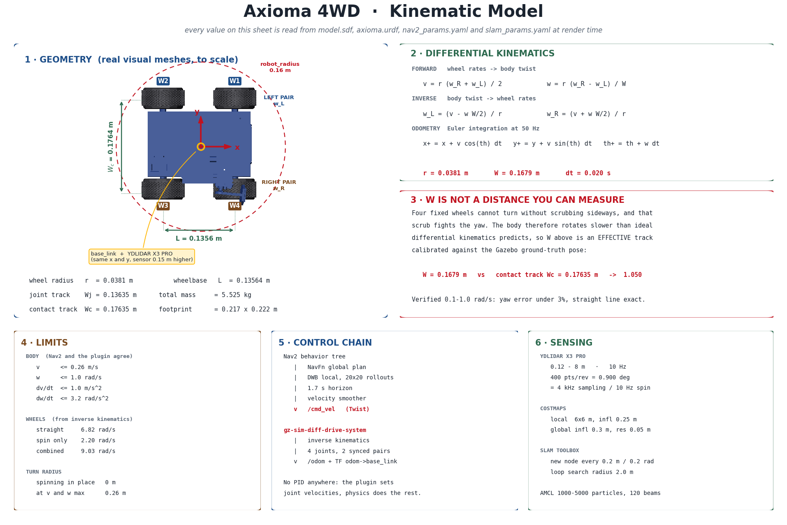

# Mathematical Model of the Axioma 4WD Robot

Model of Axioma, a **four-wheel-drive skid-steer** mobile platform. It covers
kinematics, control and physical parameters.

> **Every value comes from the code.** The ones that are calibrated rather than
> measured are marked as such, with an explanation of how they were obtained.
> The `images/mathematical-model.png` diagram is generated by
> [`render_diagram.py`](./render_diagram.py), which **reads the configuration
> files as it draws**, so it cannot fall out of date:
>
> ```bash
> python3 docs/mathematical-model/render_diagram.py
> ```

<div align="center">

</div>

---

## Contents

1. **[Kinematics](./kinematics.md)** — geometry, forward and inverse
   kinematics, odometry, and **why the model's wheel track is not a distance
   you can measure with a caliper**
2. **[Control](./control.md)** — the Gazebo plugin, where each limit is
   enforced, which parameters are decorative, Nav2 and AMCL
3. **[Parameters](./parameters.md)** — full reference table with sources
4. **[Diagram](./axioma-model.excalidraw)** — editable Excalidraw source

---

## Notation

### Coordinate frames

| Symbol | Description | ROS 2 frame |
|---------|-------------|-------------|
| $\{W\}$ | World | `map` / `odom` |
| $\{R\}$ | Robot | `base_footprint` / `base_link` |

### State variables

| Variable | Description | Unit |
|----------|-------------|--------|
| $q = [x, y, \theta]^T$ | Pose in $\{W\}$ | m, m, rad |
| $\dot q = [v, \omega]^T$ | Body twist | m/s, rad/s |
| $v_L, v_R$ | Linear velocity of each side | m/s |
| $\omega_L, \omega_R$ | Wheel angular velocity | rad/s |

---

## Fundamental equations

### Forward kinematics

$$
v = \frac{r(\omega_R + \omega_L)}{2}, \qquad
\omega = \frac{r(\omega_R - \omega_L)}{W}
$$

### Inverse kinematics

$$
\omega_L = \frac{v - \omega W/2}{r}, \qquad
\omega_R = \frac{v + \omega W/2}{r}
$$

with $r = 0.0381$ m and $W = 0.1679$ m.

### About $W$

$W$ is **not** the separation between the wheels. There are three track widths
on this robot and only one works in the equations:

| | Value | What it is |
|---|---|---|
| Joint track $W_j$ | 0.13635 m | What separates the joint origins |
| Contact track $W_c$ | 0.17635 m | What separates the contact patches |
| **Effective track $W$** | **0.1679 m** | The one that goes in the equations |

A four-fixed-wheel skid-steer cannot turn without scrubbing its wheels
sideways, and that scrub opposes the yaw. With the geometric track the robot
turned **65 %** of what the odometry believed, and the error depended on speed
as well. It is corrected with anisotropic friction plus an effective track
calibrated against Gazebo's ground-truth pose; yaw error drops below 3 % across
the whole 0.1 to 1.0 rad/s range.

Full write-up in [kinematics.md §6](./kinematics.md).

---

## Main parameters

### Geometry

| Parameter | Symbol | Value | Source |
|-----------|---------|-------|--------|
| Wheel radius | $r$ | 0.0381 m | `model.sdf` |
| Effective track | $W$ | 0.1679 m  | `model.sdf`, calibrated |
| Contact track | $W_c$ | 0.17635 m | Joint origins |
| Wheelbase | $L$ | 0.13564 m | Joint origins |
| Real footprint | — | 0.217 × 0.222 m | Visual meshes |
| Circumscribed radius | — | 0.1577 m | Visual meshes |
| Total mass | $m$ | 5.525 kg | `model.sdf` |

### Limits

The same across all three layers (DWB, velocity smoother and plugin):

| Parameter | Value |
|-----------|-------|
| Maximum linear velocity | 0.26 m/s |
| Maximum angular velocity | 1.0 rad/s |
| Maximum linear acceleration | 1.0 m/s² |
| Maximum angular acceleration | 3.2 rad/s² |

---

## Structure

```
4WD skid-steer
│
├─ Forward kinematics   (ω_L, ω_R) → (v, ω)
├─ Inverse kinematics   (v, ω) → (ω_L, ω_R)
│
├─ Control  gz-sim-diff-drive-system   (Ignition Fortress)
│  ├─ Input:   /cmd_vel   (Twist)
│  └─ Output:  /odom      (Odometry) + TF odom → base_link via odom_to_tf
│
├─ Perception  YDLIDAR X3 PRO, 0.12–8 m, 10 Hz, 400 pts/revolution
│
└─ Navigation  Nav2 Humble
   ├─ AMCL          localisation against a known map
   ├─ NavFn         global plan
   └─ DWB           local controller
```

---

## Validation

Everything is checked against **Gazebo's ground-truth pose**, not against the
odometry:

| Measurement | Result |
|--------|-----------|
| Odometry yaw error, 0.1–1.0 rad/s | < 3 % |
| Odometry translation error | exact at any speed |
| SLAM pose error, 90 m run | 0.033 m mean, 0.14 m maximum |
| Map score against the exact floor plan | 99.8 / 100 |
| Navigation | 5/5 goals, 0 recoveries, < 0.15 m |

---

## Conventions

1. Right-handed frame: $x$ forward, $y$ left, $z$ up
2. Positive angles counter-clockwise
3. Velocities expressed in the robot frame $\{R\}$
4. Four fixed wheels in two synchronised pairs, no steering

---

**Author**: Mario David Alvarez Vallejo
**Project**: Axioma Robot — Autonomous Industrial Logistics
